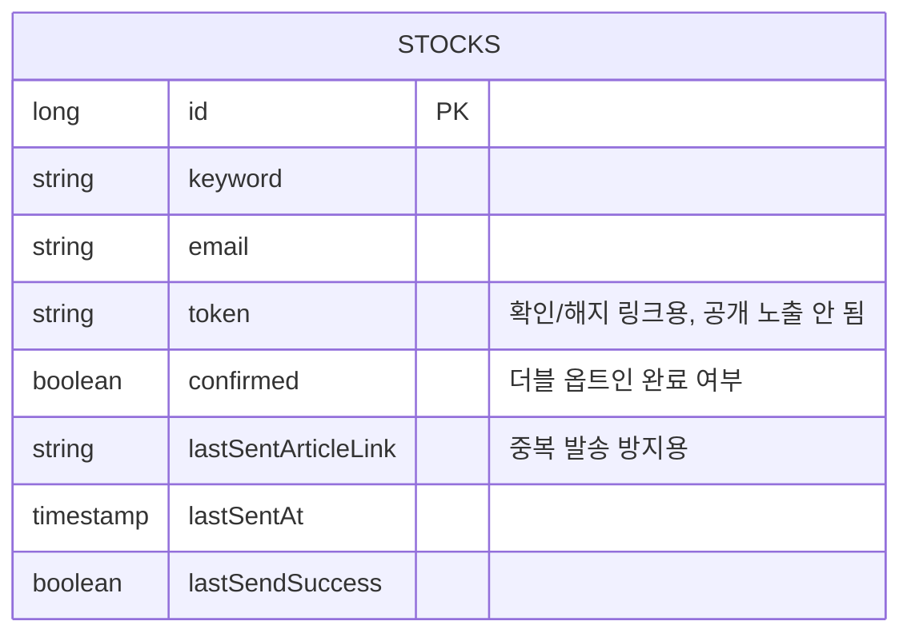

# 📰 StockPulse - 키워드 뉴스 구독 & AI 요약 다이제스트

**"관심 키워드의 최신 뉴스를 매일 아침 요약해서 이메일로 받아보세요."**

키워드를 구독하면 네이버 뉴스에서 최신 기사를 수집하고, Gemini AI로 기사별 한 줄 요약을 만들어
매일 아침 이메일로 보내주는 서비스입니다.

<br>

## 🌐 Live Demo

**🔗 Try it now:** [stockpulse.yoossi.dev](https://stockpulse.yoossi.dev/)

> Deployed on Render with PostgreSQL

<br>

## 🎯 Overview

관심 키워드 뉴스를 매번 직접 검색해서 챙겨보는 건 번거롭습니다. StockPulse는 키워드 구독 →
최신 뉴스 수집 → 기사별 AI 요약 → 이메일 발송까지 전체 과정을 자동화합니다.

**설계 원칙:** 여러 기사를 하나의 "시장 평가"로 억지로 합치지 않습니다. 대신 기사 하나하나를
있는 그대로 한 줄로 요약해서, 이 키워드가 어떤 맥락에서 언급되고 있는지 원문과 함께 보여줍니다.

<br>

## ✨ Key Features

### 🔍 키워드 기반 뉴스 수집
관심 키워드(예: 삼성전자, 비트코인, 금리)를 구독하면 네이버 뉴스 검색 API에서 **최신순**으로
기사를 가져옵니다. 중복 링크는 자동으로 제거됩니다.

### 🤖 기사별 AI 한 줄 요약
Gemini 2.5 Flash가 각 기사의 제목과 본문 일부만 근거로 한 줄 요약을 생성합니다. 여러 기사를
하나로 합치지 않고, 주어진 텍스트에 없는 내용은 추측하지 않도록 프롬프트로 제약합니다.
요약 생성에 실패한 기사는 요약 없이 제목·링크만 노출되며, 실패 사실을 요약처럼 꾸며내지 않습니다.

### 📧 매일 아침 이메일 다이제스트
Spring Scheduler가 매일 오전 7시(Asia/Seoul 고정)에 구독자별로 최신 기사+요약 이메일을 발송합니다.
직전 발송과 동일한 최신 기사면 중복 발송을 생략합니다.

### ✅ 이메일 확인(더블 옵트인) & 개인별 해지 링크
구독 신청 시 바로 발송을 시작하지 않고, 입력한 이메일로 확인 링크를 보냅니다. 그 링크를 눌러야
실제 구독이 시작됩니다. 구독 해지도 이메일에 담긴 구독자 전용 링크로만 가능해, 다른 사람의
구독을 실수로 지울 수 없습니다. 별도의 로그인/회원 시스템은 두지 않았습니다.

### ⚡ 통합 캐시 레이어
뉴스 수집 결과와 AI 요약을 하나의 캐시(30분 TTL)로 묶어서 저장해, 화면에서 보는 결과와
이메일로 발송되는 결과가 항상 같도록 보장합니다.

<br>

## 🏗️ Tech Stack

### Backend
- **Java 17** / **Spring Boot 3.5**
- **Spring Data JPA**
- **Spring Scheduler** (Cron 기반 자동화, Asia/Seoul 타임존)
- **Spring Mail** (Gmail SMTP)
- **H2** (Dev) / **PostgreSQL** (Prod)

### AI & External APIs
- **Gemini 2.5 Flash** (기사별 한 줄 요약)
- **Naver News Search API** (실시간 한국어 뉴스 수집, 최신순 정렬)

### Frontend
- **Thymeleaf** (Server-side Rendering)
- **Vanilla JavaScript** (Toast, 로딩 스피너)

### Infrastructure
- **Docker** (Containerization)
- **Render** (Cloud deployment, PostgreSQL)
- **Git / GitHub** (Version control)

<br>

## 🎨 Engineering Challenges & Solutions

### 1. AI API Rate Limiting (429 Error Handling)
**Challenge:** Gemini API 무료 티어는 rate limit이 엄격해서, 예약 발송 중 연속 요청 시 429 오류로
이메일 내용이 조용히 누락되는 문제가 있었습니다.

**Solution:**
- 뉴스 목록 + 요약을 한 묶음으로 캐싱(`DigestService`, 30분 TTL)해 반복 조회 시 API 호출 자체를 생략
- 실패 시 지수 백오프 재시도 (3회, 2초/4초 간격)
- 예약 발송 시 키워드 사이 10초 대기

### 2. 기사별 요약과 실패 처리
**Challenge:** 제목만 보고 여러 기사를 하나로 합치면 서로 다른 맥락이 섞이고, AI 호출이 실패하면
"다시 시도해주세요" 같은 문구가 마치 정상 요약처럼 노출되는 문제가 있었습니다.

**Solution:** 프롬프트에 기사별 인덱스를 부여해 기사 수만큼 정확히 요약을 받도록 강제하고, 응답이
비정상이거나 실패하면 해당 기사는 `summary = null`로 남겨 화면/이메일에서 "요약을 가져오지
못했어요"로 명확히 구분합니다. 제목과 원문 링크는 요약 성공 여부와 무관하게 항상 제공됩니다.

### 3. 중복 구독과 소유권 분리
**Challenge:** 초기 버전은 키워드 자체가 DB 고유값이라 한 키워드를 한 이메일만 구독할 수 있었고,
구독 취소 버튼이 공개 화면에 그대로 노출돼 누구나 남의 구독을 지울 수 있었습니다.

**Solution:** 고유 제약을 `(keyword, email)` 조합으로 변경해 여러 사람이 같은 키워드를 구독할 수
있게 하고, 구독자별 고유 토큰을 발급해 확인 메일·해지 링크에만 사용합니다. 공개 화면에는 전체
구독자 목록이나 삭제 버튼을 두지 않습니다.

### 4. Secure Environment Configuration
**Challenge:** API 키(Gemini, Naver, Gmail SMTP)를 버전 관리에서 제외하면서도 로컬/운영 환경에서
접근 가능해야 했습니다.

**Solution:** Spring 프로필 기반 설정 분리. `application-local.yml`(gitignored)에 개발용 값을 두고,
`application-prod.yaml`은 Render 환경변수(`DB_HOST`, `GEMINI_API_KEY`, `APP_BASE_URL` 등)를 런타임에
읽습니다.

<br>

## 🔄 System Architecture

```
사용자가 키워드+이메일로 구독 신청
        ↓
서버가 확인 메일 발송 (더블 옵트인)
        ↓
확인 링크 클릭 → 구독 활성화
        ↓
Spring Scheduler (매일 07:00 KST)
        ↓
Naver News API → 최신순 상위 10건, 링크 중복 제거
        ↓
통합 캐시 확인 → 캐시 미스 시 Gemini 2.5 Flash로 기사별 요약
        ↓
직전 발송과 최신 기사 동일 여부 확인 → 새 기사 없으면 발송 생략
        ↓
Gmail SMTP → 기사별 요약 + 개인별 해지 링크 포함 다이제스트 발송
```

<br>

## 📊 Database Schema



(keyword, email) 조합에 고유 제약이 걸려 있어, 같은 키워드를 여러 이메일이 각자 구독할 수 있습니다.

<br>

## 🚀 Getting Started (Local Development)

### 1. Clone & Setup
```bash
git clone https://github.com/cheongcel/stockpulse.git
cd stockpulse
```

### 2. Configure API Keys
`src/main/resources/application-local.yml` 생성:
```yaml
spring:
  profiles:
    active: local
  datasource:
    url: jdbc:h2:mem:testdb
  mail:
    username: your-gmail@gmail.com
    password: your-app-password

app:
  base-url: http://localhost:8080

naver:
  api:
    client-id: YOUR_NAVER_CLIENT_ID
    client-secret: YOUR_NAVER_CLIENT_SECRET

gemini:
  api:
    key: YOUR_GEMINI_API_KEY
```

### 3. Run
```bash
./gradlew bootRun
```

### 4. Access
```
http://localhost:8080
```

<br>

## 📈 Future Roadmap

- [ ] **Test Coverage:** 동일 키워드 다중 구독, 본인 구독 해지, 외부 API 실패, 중복 발송 방지에 대한
      JUnit5/Mockito 테스트
- [ ] **Mobile-friendly UI:** 모바일 너비 대응, 로딩/빈 결과/실패 화면 다듬기
- [ ] **키워드 미리보기:** 구독 전에 이메일 없이 최신 뉴스만 먼저 볼 수 있는 화면
- [ ] **Load Testing:** 동시 구독 요청에 대한 성능 검증

<br>

## 📝 License

MIT License

<br>

## 👤 Developer

**Cheongcel**
- GitHub: [@cheongcel](https://github.com/cheongcel/stockpulse)
- Live Demo: [stockpulse.yoossi.dev](https://stockpulse.yoossi.dev)
- Email: andfrank@naver.com
---
