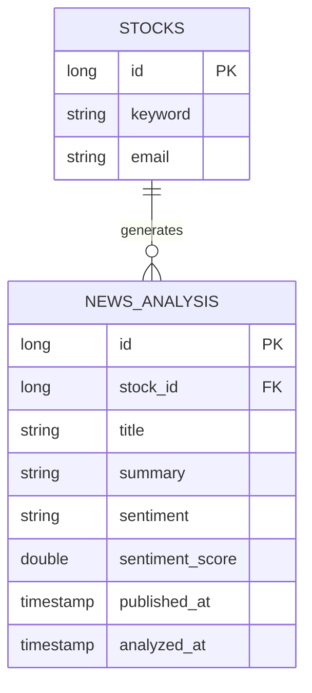

# 📰 StockPulse - AI News Sentiment Analyzer

**"Stay ahead of the market. Get AI-powered news digests delivered every morning."**

A keyword-based news analysis service that automatically collects, summarizes, and delivers daily news digests via email using AI sentiment analysis.

<br>
## 🌐 Live Demo

**🔗 Try it now:** [stockpulse.yoossi.dev](https://stockpulse.yoossi.dev/) 


> Deployed on Render with PostgreSQL

<br>
## 🎯 Strategic Overview

Individual investors and professionals spend an average of 20+ minutes daily manually searching for keyword-related news across multiple sources. StockPulse eliminates this friction by automating the entire pipeline — from news collection to AI summarization and email delivery.

**The Problem:** Manual news monitoring is time-consuming, fragmented, and inconsistent. Investors miss critical market signals due to information overload.

**The Solution:** A fully automated pipeline that collects top 10 relevant news articles via Naver News API, analyzes sentiment using Gemini AI, and delivers a structured daily digest — reducing monitoring time by over 90%.

<br>
## ✨ Key Features

### 🔍 Keyword-Based News Collection
Subscribe to any keyword (e.g. 삼성전자, 비트코인, 금리) and receive curated news from Naver News Search API sorted by relevance.

### 🤖 AI Sentiment Analysis
Gemini 2.5 Flash analyzes the tone and content of collected news, generating a 3-sentence summary with sentiment classification (Positive / Negative / Neutral).

### 📧 Daily Email Digest
Spring Scheduler automatically triggers at 7AM KST every morning, sending personalized news summaries to each subscriber's email.

### ⚡ Local Cache Layer
In-memory caching (30-minute TTL) prevents redundant Gemini API calls for repeated keyword lookups, reducing API usage and eliminating 429 rate-limit errors.

### 🗂️ Subscription Management
Users can subscribe to multiple keywords, view analysis results in real-time, and unsubscribe with a single click.

<br>
## 🏗️ Tech Stack

### Backend
- **Java 17** / **Spring Boot 3.5**
- **Spring Data JPA**
- **Spring Scheduler** (Cron-based automation)
- **Spring Mail** (Gmail SMTP)
- **H2** (Dev) / **PostgreSQL** (Prod)
### AI & External APIs
- **Gemini 2.5 Flash** (News summarization & sentiment analysis)
- **Naver News Search API** (Real-time Korean news collection)
### Frontend
- **Thymeleaf** (Server-side Rendering)
- **Vanilla JavaScript** (Toast notifications, loading spinner)
### Infrastructure
- **Docker** (Containerization)
- **Render** (Cloud deployment)
- **Git / GitHub** (Version control)
  <br>
## 🎨 Engineering Challenges & Solutions

### 1. AI API Rate Limiting (429 Error Handling)
**Challenge:** Gemini API enforces strict rate limits on the free tier. Consecutive keyword analysis requests during scheduled digest delivery triggered 429 errors, causing silent failures in email content.

**Solution:** Implemented a two-layer defense strategy:
- **Local in-memory cache** (`ConcurrentHashMap`) with 30-minute TTL to serve repeated requests without API calls
- **Exponential backoff retry logic** (3 attempts, 2s/4s delay) for transient failures
- **Inter-keyword delay** (10 seconds) during scheduled batch processing to respect rate limits
```java
// Cache hit check before API call
if (cacheResults.containsKey(ticker)) {
    long savedTime = cacheTimes.get(ticker)[0];
    if (System.currentTimeMillis() - savedTime < CACHE_TTL) {
        log.info("Cache hit: {}", ticker);
        return cacheResults.get(ticker);
    }
}
```

### 2. Structured AI Output Parsing
**Challenge:** LLM responses are inherently unpredictable — Gemini occasionally wraps JSON in markdown code blocks or returns malformed structures, breaking downstream parsing logic.

**Solution:** Implemented defensive prompt engineering combined with post-processing sanitization. The prompt explicitly constrains output format, while the parser strips markdown artifacts before JSON deserialization.

```java
// Strip markdown code blocks before parsing
text = text.replaceAll("```json", "").replaceAll("```", "").trim();
ObjectMapper mapper = new ObjectMapper();
JsonNode node = mapper.readTree(text);
```

### 3. Secure Environment Configuration
**Challenge:** API keys (Gemini, Naver, Gmail SMTP) must be kept out of version control while remaining accessible across local and production environments.

**Solution:** Implemented Spring profile-based configuration separation. `application-local.yml` (gitignored) holds development secrets, while `application-prod.yml` reads all sensitive values from Render environment variables at runtime.

<br>
## 🔄 System Architecture

```
User subscribes to keyword
        ↓
Spring Scheduler (7AM KST daily)
        ↓
Naver News API → Top 10 articles by relevance
        ↓
Local Cache check → Cache miss → Gemini 2.5 Flash
        ↓
JSON parsing → summary extraction
        ↓
Gmail SMTP → Email digest delivery
```

<br>
## 📊 Database Schema



<br>
## 🚀 Getting Started (Local Development)

### 1. Clone & Setup
```bash
git clone https://github.com/cheongcel/stockpulse.git
cd stockpulse
```

### 2. Configure API Keys
Create `src/main/resources/application-local.yml`:
```yaml
spring:
  profiles:
    active: local
  datasource:
    url: jdbc:h2:mem:testdb
  mail:
    username: your-gmail@gmail.com
    password: your-app-password
 
naver:
  api:
    client-id: YOUR_NAVER_CLIENT_ID
    client-secret: YOUR_NAVER_CLIENT_SECRET
 
gemini:
  api:
    key: YOUR_GEMINI_API_KEY
```

### 3. Run
```bash
./gradlew bootRun
```

### 4. Access
```
http://localhost:8080
```

<br>
## 📈 Future Roadmap

- [ ] **Sentiment Trend Chart:** Visualize keyword sentiment over time using Chart.js
- [ ] **Full Article Analysis:** Crawl and analyze article body text for deeper insights
- [ ] **Test Coverage:** JUnit5/Mockito unit and integration tests
- [ ] **Load Testing:** Validate performance under concurrent subscription requests
  <br>
## 📝 License

MIT License

<br>
## 👤 Developer

**Cheongcel**
- GitHub: [@cheongcel](https://github.com/cheongcel/stockpulse)
- Live Demo: [stockpulse-dcw8.onrender.com](https://stockpulse-dcw8.onrender.com)
- Email: andfrank@naver.com
---
